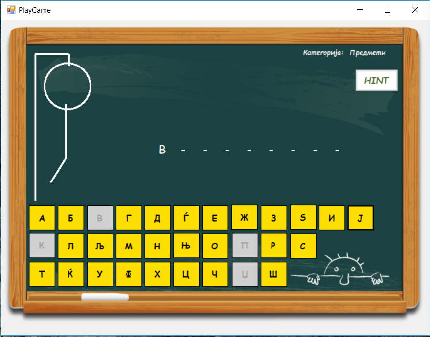
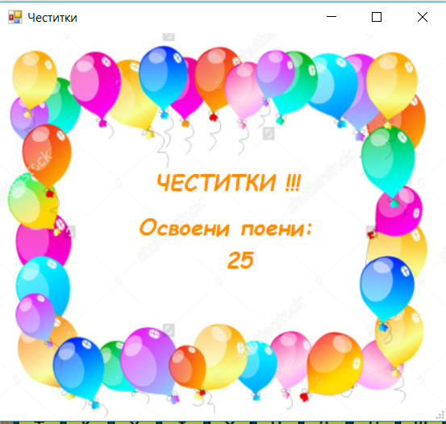

# VP-Proekt-2017
Windows Forms Project by Anastasija Makashevska (143007)
================

<b>Објаснување на проблемот</b>

Апликацијата претставува едноставна верзија на играта бесилка. Добро познатата игра е имплементирана така што се погодува некој збор од претходно одбрана категорија. Играчот има 6 обиди за да го погоди зборот, па затоа колку е поголем зборот толку повеќе поени се собираат.

<b>Правила за игра</b>

Најпрво корисникот мора да одбере категорија од која ќе припаѓа зборот кој се погодува. Можни категории се: предмети, имиња, градови и спортови. При процесот на играње една буква може да се одбере само еднаш, по што ако не ја погоди буквата се црта еден дел од телото на човечето, а ако ја погоди се прикажува буквата на сите позиции на кои ја има истата. Ако успее да го погоди зборот без да згреши 6 пати (целото тело на човечето да биде обесено), тогаш играчот победил и може да дознае колку поени освоил.

<b>Имплементација на решението</b>

<u>Преглед на компонентите:</u>
<ul>
<li>4 форми (Form1, PlayGame, GameOver, CongratsForm)</li>
<li><b>Класи:</b></li>
		<li> Category.cs - класа за репрезентација на категоријата на која може да припаѓаат зборовите кои се погодуваат (со 2 propreties: Id, Name)</li>
		<li>WordToGuess.cs - класа за репрезентација на самите зборови кои се погодуваат (содржи 2 propreties: категоријата на која и припаѓа и самиот збор)</li>
		<li> Game.cs - класата претставува импорвизирана база на категории и зборови од соодветни категории, плус дополнителено нуди функционалност за враќање на случаен збор од некојa категорија на зборови. Зборовите и категориите се чуваат во генерички листи.</li>
</ul>

<b>Функционалности</b>

Најголем дел од функционалностите се во позадинскиот дел на PlayGame формата. Истата содржи настани за цртање и кликање, функции за проверка дали букавата е погодена, дали целиот збор е погоден и давање на хинтови.
Во продолжение е објаснето како функционира логиката за проверка дали е некоја буква е погодена.

	protected void guessLetter(Button buttonLetter){
           
            char letterSuggestion = buttonLetter.Text[0];
            List<int> positions = findCharInWord(letterSuggestion);
            if (positions.Count > 0)
            {
                foreach (int position in positions)
                {
                    labelsLetters[position].Text = wordToGuess[position].ToString();
                    points += 5;
                }

            }
            else
            {
                ++misses;
                drawMiss(misses);
                points -= 1;
            }
            buttonLetter.Enabled = false;
            LostGame();
            if (isLost== false && IsWholeWordGuesed())
            {
                CongratsForm cf = new CongratsForm(points);
                cf.ShowDialog();
                this.Close();
            }
            

        }
Оваа функција се повикува од настанот на копчињата за буквите, од тука како влезен аргумент се предава копчето на кое било притиснато. Пребаруваме во зборот кој треба да се погоди по текстот копчето. За пронаоѓање на сите можни позиции на кои ја има буквата користиме нова функција findCharInWord(с).

	 protected List<int> findCharInWord(char letter)
        {

            List<int> resultIndexes = new List<int>();

            for (int i = 0; i < wordToGuess.Length; i++)
            {
                if (wordToGuess[i] == letter)
                {
                    resultIndexes.Add(i);
                }
            }

            return resultIndexes;
        }
По едноставна итерација и проверка на буквите во зборот ги зачувуваме соодветните позиции и таа листа од позиции ја враќаме во претходно споменатата функција. За секоја погодена буква се додаваат 5 поени а за секоја промашена се одзема 1 поен. Погодените букви се прикажуваат во листа од лабели (со иста должина еднаква на зборот) на позициите кои ги добивме од findCharInWord(с). 

<b>Упатство за користење</b>

Користењето на оваа апликација е многу едноставно.

Најпрво корисникот треба да избере категорија и и да притисне на нова игра.
      
Потоа се појавува прозорчето за играње. Тука на жолтите копчиња со букви може да погодува буква, а кога ќе погоди некоја буква ќе се покаже на позициите на кои ја има. Ако пак ја нема ќе се исцрта дел од тело на бесилката. Во горниот десен агол има копче HINT на кое корисникот може да побара помош но само еднаш. Со тоа една буква ќе му биде прикажана, но и ќе му се одземат 5 поени.

Екран доколку победил, со број на поени.

Екран доколку изгубил, односно не го погодил зборот, со можност за нова игра.
